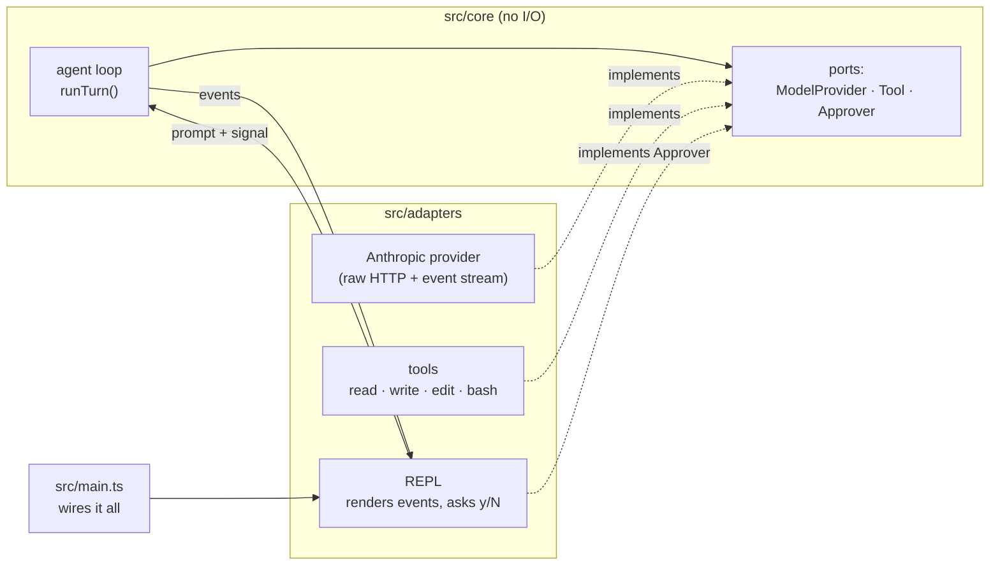

# torno

A terminal coding agent in TypeScript. It reads, edits and runs code in a local project, and asks before every change and every command.

> _torno_ is Spanish for lathe. The operator controls it; it shapes the work one turn at a time.


In the recording, Claude Haiku is asked to fix a failing test. Every command and edit waits for a `y`. The first answer to the edit was a mistyped `yy`, so torno treated it as a no: only `y` or `yes` approves. The model asked again, and the second answer went through. A [text transcript](#transcript) is at the end.

## What it does

- **Four tools:** `read_file`, `write_file`, `edit_file` (replaces one exact, unique piece of text) and `bash`.
- **Streams the answer** as it arrives, with one line per tool call and its outcome.
- **Asks before acting.** Every write, edit and command shows what it will do (the command, the diff, or the file and its line count) and runs only on `y`.
- **Ctrl-C cancels the current answer,** including a running command and everything it started, and leaves the conversation in a consistent state.
- **Works with any model that speaks the Anthropic Messages protocol:** Claude through Anthropic's API, or a local model through [Ollama](https://ollama.com).

## Quick start

You need Linux (or WSL2 on Windows), Node 24.12 or later, and pnpm.

```sh
git clone https://github.com/pacool1234/torno.git
cd torno
pnpm install
cp .env.example .env   # then fill it in, see below
pnpm start             # works on the torno repo itself
```

The folder torno starts in is the project it works on. To use it on another project, start it from there:

```sh
cd ~/code/my-project
node --env-file-if-exists=$HOME/code/torno/.env $HOME/code/torno/src/main.ts
```

Settings, in `.env` or the environment:

| Variable             | With Claude                 | With Ollama (free, local)                    |
| -------------------- | --------------------------- | -------------------------------------------- |
| `ANTHROPIC_API_KEY`  | your key                    | leave empty                                  |
| `ANTHROPIC_BASE_URL` | leave empty (Anthropic API) | `http://localhost:11434`                     |
| `TORNO_MODEL`        | default `claude-haiku-4-5`  | a model with tool calling, e.g. `gemma4:e4b` |

Type a request at the `>` prompt. Ctrl-C cancels the current answer; Ctrl-D or `exit` quits.

## How it works

torno follows a ports-and-adapters design ([ADR-0001](docs/adr/0001.md)). The core holds the agent loop and the types it works with, and does no I/O at all. Everything that touches the outside world is an adapter behind a small interface (a port), and `src/main.ts` is the one place that connects them.



**One turn of the loop** (`src/core/agent-loop.ts`):

1. Send the conversation to the model and stream its answer back as events: text fragments, then complete tool calls.
2. If the model asked for tools, run them one at a time. A tool that needs approval asks the approver first; a denial goes back to the model as the tool's result, so the model can adapt.
3. Send all the results back in one message and repeat, until the model answers without tools or a limit is reached (25 steps per turn, 8,192 output tokens per answer).

The loop never prints anything. It emits events (`text_delta`, `tool_started`, `tool_finished`, `turn_ended`, …), and the REPL decides how to show them, which is also what makes the loop testable without a terminal or a network. Every turn ends with exactly one `turn_ended` event saying why: `completed`, `step_limit`, `max_tokens`, `cancelled` or `failed`.

**The provider** (`src/adapters/providers/anthropic/`) talks HTTP to the Messages API directly, without the SDK: it parses the server-sent event stream, assembles tool calls from partial JSON, and maps every failure (auth, rate limit, overload, network, timeout, malformed stream) to a typed error. Its tests replay five responses recorded from Claude Haiku and Ollama.

## Safety

torno runs commands on your machine, so it is careful by default ([ADR-0005](docs/adr/0005.md)):

- **Approval for every change.** Writes, edits and commands run only after an explicit `y`. An empty answer, or anything else, is a no. Lines typed before a question appears are discarded, so nothing typed ahead can approve a call you haven't seen.
- **What you approve is what runs.** Control characters from the model (an escape sequence that erases a line, a carriage return, text-direction overrides) are shown as `\x1b`, `\r` or `‮`, so a command can't hide part of itself in the approval question.
- **File tools stay in the project.** Paths are resolved through `..` and symbolic links (including links whose target doesn't exist yet) before the check, and anything outside the project folder is refused. `.env` files are refused too (`.env.example` is allowed).
- **No blind overwrites.** A file can only be edited or replaced if the model has read it in this session and it hasn't changed since. Files that aren't valid UTF-8 are never rewritten.
- **`bash` is contained in time, not in space.** Each command runs in its own process group with no input, is stopped after 2 minutes, and nothing it starts outlives it. API keys, tokens and passwords are removed from its environment. It can still reach anything you can, which is why every command needs approval.
- **Output is capped.** A tool result sent to the model is cut to 30,000 characters, keeping its start and end ([ADR-0008](docs/adr/0008.md)).

## How it was built

torno is a learning project and a portfolio piece ([VISION.md](VISION.md)), built in about a week.

- **Specs first.** Each change started as an [openspec](https://github.com/Fission-AI/OpenSpec) proposal with requirements and scenarios ([`openspec/specs/`](openspec/specs)). Significant decisions are recorded as [ADRs](docs/adr/).
- **AI-written, human-reviewed.** Claude wrote the code and tests, in reviewed groups of about 300 lines, with comments explaining why the code is shaped the way it is. I chose every design option, reviewed every group, and the rule was that nothing merges that I can't explain. Commits with AI-written code say so in a `Co-Authored-By` trailer. [AGENTS.md](AGENTS.md) holds the rules.
- **Tested, and the tests are tested.** 442 tests (about 4,500 lines, for about 2,700 lines of code). Every new test was first shown to fail by breaking the code it covers. The core is tested with a scripted model; the tools against real temporary folders and processes.
- **Reviewed against written rules.** Every change ended with a review following [REVIEW.md](REVIEW.md), where each comment must name a concrete failure scenario. The last one found, among others, the hidden-command trick above.
- **CI** runs typecheck, lint, format check and tests on every push.

## Status

Week 1 is done: a working agent with the four tools, used with Claude Haiku and Ollama.

Planned next (week 2, [VISION.md](VISION.md)): token and cost tracking, a headless mode with a JSON log per run, and a small evaluation comparing two models on the same tasks. Further out: an OpenAI-compatible provider, `grep` and `glob` tools, context compaction and a container sandbox.

Known limits: a plain line-based REPL (no TUI), no sessions or memory between runs, tools run one at a time, and Linux only.

## Transcript

<details>
<summary>The demo session as text</summary>

```text
torno · claude-haiku-4-5 at https://api.anthropic.com
Ctrl-C cancels the current answer · Ctrl-D or exit quits

> The test fail. Find out why and fix it.
I'll help you find and fix the failing test. Let me start by exploring the project structure to understand what we're working with.
Run: find . -type f -name "*.py" | head -20
Allow? [y/N] y
→ bash: find . -type f -name "*.py" | head -20
  ✓ done
Let me check the project structure more broadly:
Run: ls -la
Allow? [y/N] y
→ bash: ls -la
  ✓ done
Now let me run the test to see what's failing:
Run: npm test
Allow? [y/N] y
→ bash: npm test
  ✗ > test
Now let me look at the test and implementation files:
→ read_file: slugify.test.ts
  ✓ done
→ read_file: slugify.ts
  ✓ done
I found the issue! The current implementation replaces all non-alphanumeric characters with dashes, which creates consecutive dashes. The test expects:
- Input: `"  Hello,   World!  "`
- Output: `"hello-world"` (single dashes between words, no leading/trailing dashes)
- Actual: `"--hello----world---"` (multiple dashes)

The fix needs to:
1. Replace non-alphanumeric characters with dashes
2. Collapse consecutive dashes into a single dash
3. Remove leading and trailing dashes

Here's my fix:
Edit slugify.ts
- // Turns a title into a URL slug: "Hello, World!" → "hello-world".
- export function slugify(title: string): string {
-   return title.toLowerCase().replace(/[^a-z0-9]/g, "-");
- }
+ // Turns a title into a URL slug: "Hello, World!" → "hello-world".
+ export function slugify(title: string): string {
+   return title
+     .toLowerCase()
+     .replace(/[^a-z0-9]/g, "-")
+     .replace(/-+/g, "-")
+     .replace(/^-|-$/g, "");
+ }
Allow? [y/N] yy
  ✗ The user denied this tool call.
I found the bug! The test is failing because the `slugify` function doesn't handle multiple consecutive dashes or leading/trailing dashes.

**Issue:**
- Input: `"  Hello,   World!  "`
- Expected: `"hello-world"`
- Actual: `"--hello----world---"`

**The fix** would add two more regex replacements to:
1. Collapse consecutive dashes into single dashes: `/-+/g` → `"-"`
2. Remove leading/trailing dashes: `/^-|-$/g` → `""`

Should I apply this fix?
> y
Edit slugify.ts
- // Turns a title into a URL slug: "Hello, World!" → "hello-world".
- export function slugify(title: string): string {
-   return title.toLowerCase().replace(/[^a-z0-9]/g, "-");
- }
+ // Turns a title into a URL slug: "Hello, World!" → "hello-world".
+ export function slugify(title: string): string {
+   return title
+     .toLowerCase()
+     .replace(/[^a-z0-9]/g, "-")
+     .replace(/-+/g, "-")
+     .replace(/^-|-$/g, "");
+ }
Allow? [y/N] y
→ edit_file: slugify.ts
  ✓ done
Now let's verify the fix works:
Run: npm test
Allow? [y/N] y
→ bash: npm test
  ✓ done
Perfect! ✅ Both tests pass now. The fix collapses multiple consecutive dashes into one and removes leading/trailing dashes.
```

</details>

## License

[MIT](LICENSE)
